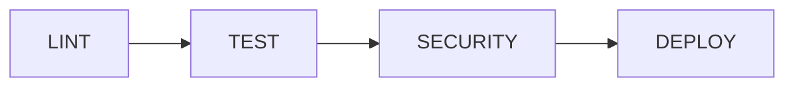

# 🛒 Sistema de Gestão de Produtos

[](https://gitlab.com/seu-usuario/sistema-produtos/-/pipelines)
[](htmlcov/index.html)
[](test_produto_manager.py)
[](https://www.python.org/)

Sistema web completo para gerenciamento de inventário de produtos com funcionalidades de cadastro, listagem e compras.

## 🎯 Atividade 6 - Pipeline CI/CD

Este projeto implementa um **pipeline completo de CI/CD no GitLab** com:

✅ **Linting:** flake8, pylint, black, radon  
✅ **Testes Unitários:** 39 testes com pytest (79% coverage)  
✅ **Análise de Segurança:** bandit, safety  
✅ **Deploy Automático:** staging e production  

### 📊 Métricas de Qualidade

- **Testes:** 39 passing (30 unitários + 9 integração)
- **Coverage:** 79% total, 100% no módulo principal
- **Linting:** 0 erros flake8
- **Complexidade:** Baixa (radon score A/B)

## 📋 Características

- ✅ Gerenciamento de produtos com JSON
- ✅ Geração automática de IDs
- ✅ Validação de campos obrigatórios
- ✅ Listagem em ordem alfabética
- ✅ Sistema de compras com verificação de estoque
- ✅ Interface web moderna e responsiva
- ✅ API REST para integração
- ✅ Persistência de dados em arquivo JSON

## 🚀 Estrutura do Projeto

```
casseb2310/
├── app.py                      # Aplicação Flask principal
├── produto_manager.py          # Módulo de gerenciamento de produtos
├── templates/                  # Templates HTML
│   ├── base.html
│   ├── index.html
│   ├── adicionar.html
│   └── comprar.html
├── .gitlab-ci.yml             # ⭐ Pipeline CI/CD GitLab
├── requirements.txt            # Dependências Python
├── requirements-dev.txt        # ⭐ Dependências de desenvolvimento
├── .flake8                    # ⭐ Configuração Flake8
├── .pylintrc                  # ⭐ Configuração Pylint
├── pyproject.toml             # ⭐ Configuração Black/Pytest
├── test_produto_manager.py    # ⭐ 30 testes unitários
├── test_app.py                # ⭐ 9 testes de integração
├── Procfile                   # Configuração Render
├── runtime.txt                # Versão Python
├── .gitignore                 # Arquivos ignorados pelo Git
└── README.md                  # Esta documentação
```

## 🧪 Testes e Qualidade

### Executar Testes Localmente

```bash
# Instalar dependências de desenvolvimento
pip install -r requirements-dev.txt

# Executar todos os testes
pytest -v

# Executar com coverage
pytest --cov=. --cov-report=html

# Ver relatório de coverage
# Abra htmlcov/index.html no navegador
```

### Linting e Formatação

```bash
# Verificar estilo de código
flake8 app.py produto_manager.py

# Análise estática
pylint app.py produto_manager.py

# Formatar código automaticamente
black app.py produto_manager.py test_*.py

# Análise de complexidade
radon cc app.py produto_manager.py -a
```

## 💻 Execução Local

### 1. Clone o repositório
```bash
git clone <seu-repositorio>
cd casseb2310
```

### 2. Crie um ambiente virtual
```bash
python -m venv venv
```

### 3. Ative o ambiente virtual
**Windows:**
```bash
venv\Scripts\activate
```

**Linux/Mac:**
```bash
source venv/bin/activate
```

### 4. Instale as dependências
```bash
pip install -r requirements.txt
```

### 5. Execute a aplicação
```bash
python app.py
```

A aplicação estará disponível em: `http://localhost:5000`

## 🔄 Pipeline GitLab CI/CD

Este projeto utiliza GitLab CI/CD com 4 stages:

### Pipeline Structure



### Stage 1: LINT
- **flake8:** Verificação PEP8
- **pylint:** Análise estática
- **black:** Formatação de código
- **radon:** Complexidade e manutenibilidade

### Stage 2: TEST
- **unit-tests:** 39 testes com pytest
- **integration-tests:** Testes de integração
- **Coverage:** Relatório de cobertura

### Stage 3: SECURITY
- **safety:** Vulnerabilidades em dependências
- **bandit:** Problemas de segurança no código

### Stage 4: DEPLOY
- **staging:** Deploy em ambiente de testes
- **production:** Deploy em produção

### Como Usar o Pipeline

1. **Faça push para o GitLab:**
```bash
git push origin main
```

2. **Acompanhe a execução:**
- Acesse: GitLab → CI/CD → Pipelines
- Veja o status de cada job
- Pipeline verde ✅ = Tudo OK!

3. **Ver artefatos:**
- Relatórios de coverage em `htmlcov/`
- Relatórios flake8 em `flake8-report/`

**📖 Guia Completo:** Veja [GITLAB_PIPELINE_GUIDE.md](GITLAB_PIPELINE_GUIDE.md) para instruções detalhadas.

**🎯 Entrega:** Veja [ENTREGA_ATIVIDADE_6.md](ENTREGA_ATIVIDADE_6.md) para checklist de entrega.

## 🌐 Deploy no Render

### Passos para Deploy:

1. **Crie uma conta no Render** (https://render.com)

2. **Conecte seu repositório GitHub**
   - Faça push do código para o GitHub
   - No Render Dashboard, clique em "New +"
   - Selecione "Web Service"
   - Conecte seu repositório

3. **Configure o Web Service:**
   - **Name:** `sistema-produtos` (ou nome de sua preferência)
   - **Environment:** `Python 3`
   - **Build Command:** `pip install -r requirements.txt`
   - **Start Command:** `gunicorn app:app`
   - **Instance Type:** Free

4. **Variáveis de Ambiente (opcional):**
   - `SECRET_KEY`: Sua chave secreta para sessões Flask

5. **Deploy:**
   - Clique em "Create Web Service"
   - Aguarde o deploy (leva alguns minutos)

### URL da Aplicação:
Após o deploy, sua aplicação estará disponível em:
```
https://sistema-produtos.onrender.com
```
(substitua pelo nome que você escolheu)

## 📚 Funcionalidades

### 1. Adicionar Produto
- Acesse "Adicionar Produto"
- Preencha: Nome, Quantidade, Valor
- ID é gerado automaticamente
- Todos os campos são obrigatórios

### 2. Listar Produtos
- Visualize todos os produtos cadastrados
- Informações: ID, Nome, Quantidade, Valor
- Opção de compra para cada produto

### 3. Ordem Alfabética
- Lista produtos ordenados por nome
- Facilita a busca de produtos específicos

### 4. Comprar Produtos
- Selecione o produto
- Informe a quantidade
- Sistema verifica disponibilidade
- Exibe total da compra
- Confirme para efetivar
- Estoque é atualizado automaticamente

## 🔌 API REST

### Endpoints disponíveis:

#### GET /api/produtos
Lista todos os produtos
```bash
curl http://localhost:5000/api/produtos
```

#### GET /api/produtos/alfabetica
Lista produtos em ordem alfabética
```bash
curl http://localhost:5000/api/produtos/alfabetica
```

#### POST /api/produtos
Adiciona novo produto
```bash
curl -X POST http://localhost:5000/api/produtos \
  -H "Content-Type: application/json" \
  -d '{"produto": "Notebook", "quantidade": 10, "valor": 2500.00}'
```

#### POST /api/comprar
Processa compra
```bash
curl -X POST http://localhost:5000/api/comprar \
  -H "Content-Type: application/json" \
  -d '{"produto_id": 1, "quantidade": 2, "confirmar": true}'
```

## 🗂️ Estrutura de Dados

Cada produto é um objeto JSON:
```json
{
  "id": 1,
  "produto": "Notebook Dell",
  "quantidade": 10,
  "valor": 2500.00
}
```

## 🛠️ Tecnologias Utilizadas

- **Python 3.11**
- **Flask** - Framework web
- **Gunicorn** - Servidor WSGI para produção
- **HTML/CSS** - Interface responsiva
- **JSON** - Armazenamento de dados

## 📝 Notas Importantes

- Os dados são salvos em `produtos.json` no mesmo diretório
- Em produção no Render, o sistema de arquivos é efêmero (dados podem ser perdidos no redeploy)
- Para persistência permanente, considere usar um banco de dados (PostgreSQL no Render)

## 🔒 Segurança

- Configure a variável `SECRET_KEY` em produção
- Validação de dados de entrada
- Proteção contra valores negativos
- Verificação de estoque antes da compra

## 📄 Licença

Este projeto foi criado para fins educacionais.

## 👨‍💻 Autor

Criado em 23/10/2025
